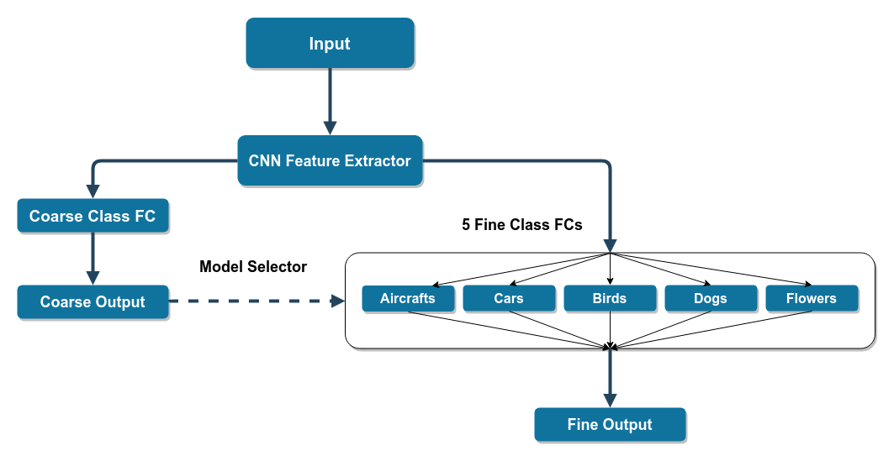
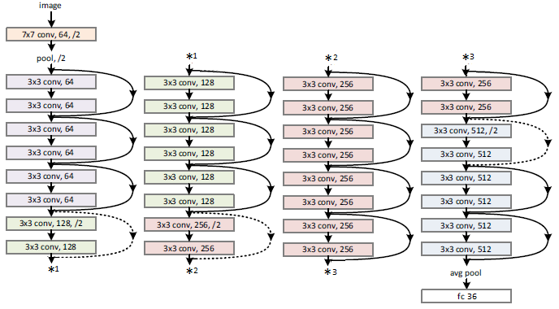

# coarse-fine-classification
Classifying images into coarse and fine classes. https://web.cse.iitk.ac.in/users/cs783/asm2/
### Prerequisites
The code is written using vscode with python extension. The code can be run cell wise using jupyter and vscode. More infom [here.](https://code.visualstudio.com/docs/python/jupyter-support)
### Dataset
Dataset can be found [here.](https://drive.google.com/drive/folders/1H8H2NS193l78A6xsDyi5iEQpUGlSsn51?fbclid=IwAR0J7KFVd_sdPBCyQwqw5balQHpTLoTxqfdv5pZ_ElMb5IyRS9MDw2ejlyw)
### Preprocessing
Divide the dataset into train, test and validation folders (in any required ratio). See the file pre_processing_*.py for more info.
### Architecture
#### Procedure 1

#### Procedure 2

#### Report
Detailed report of the two methods can be found [here.](extras/report.pdf)
